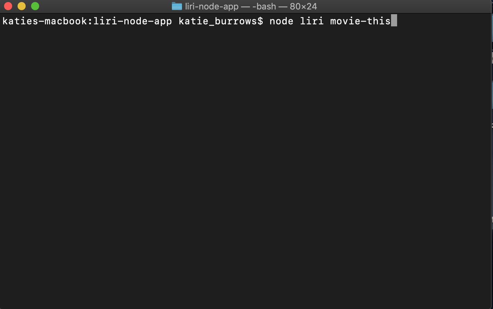
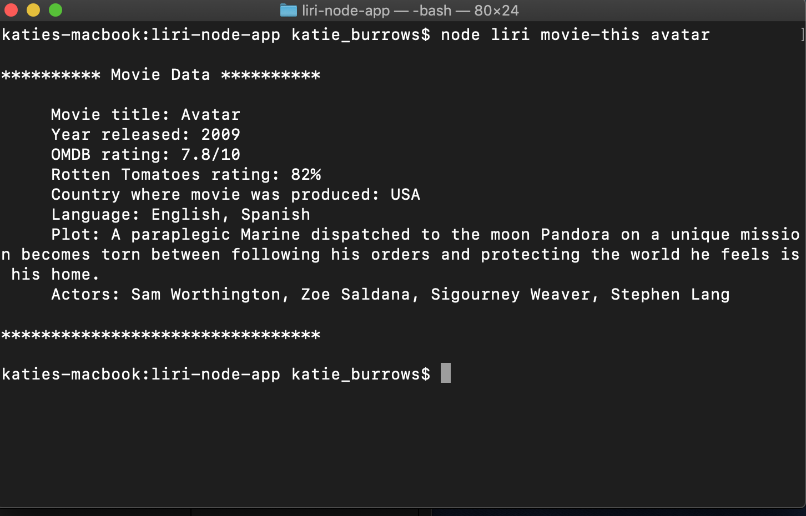
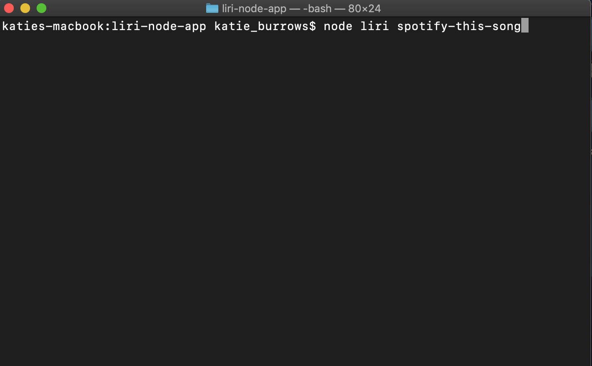
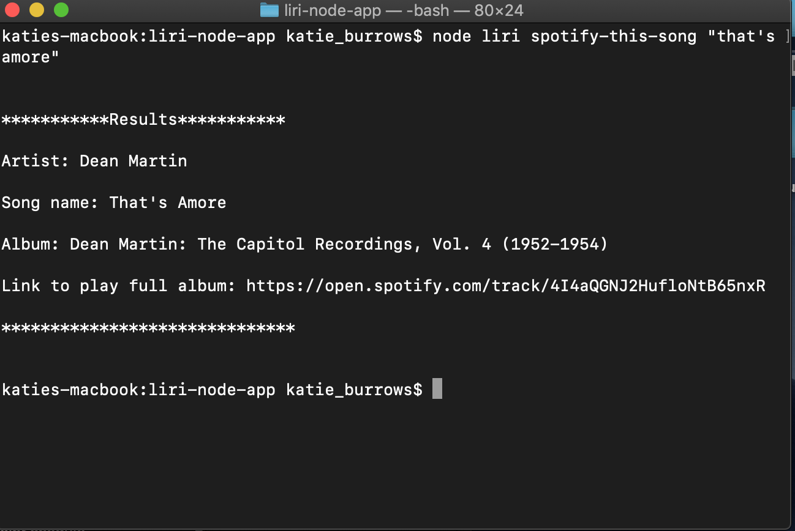
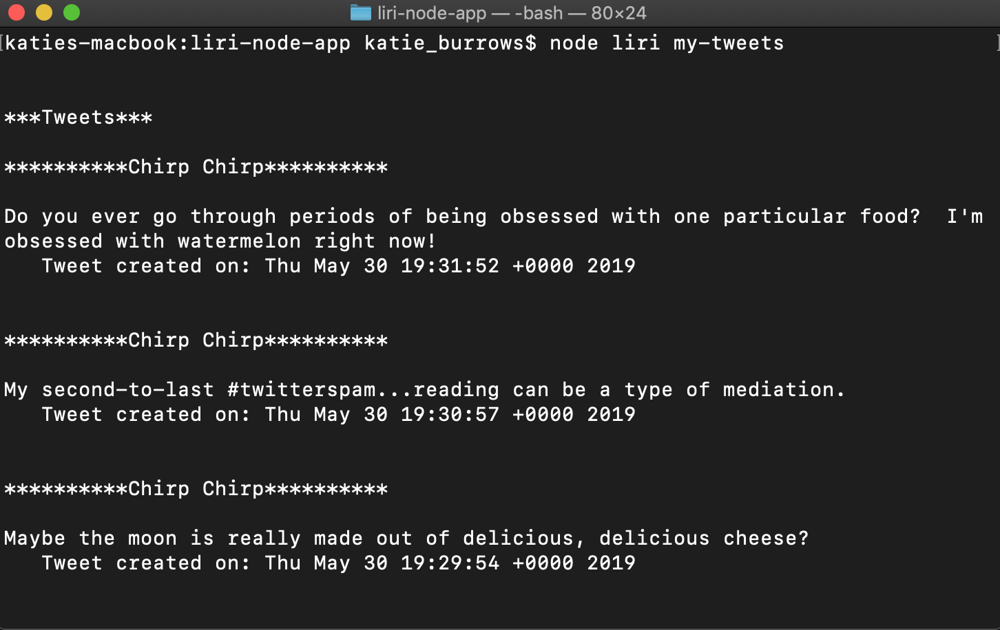
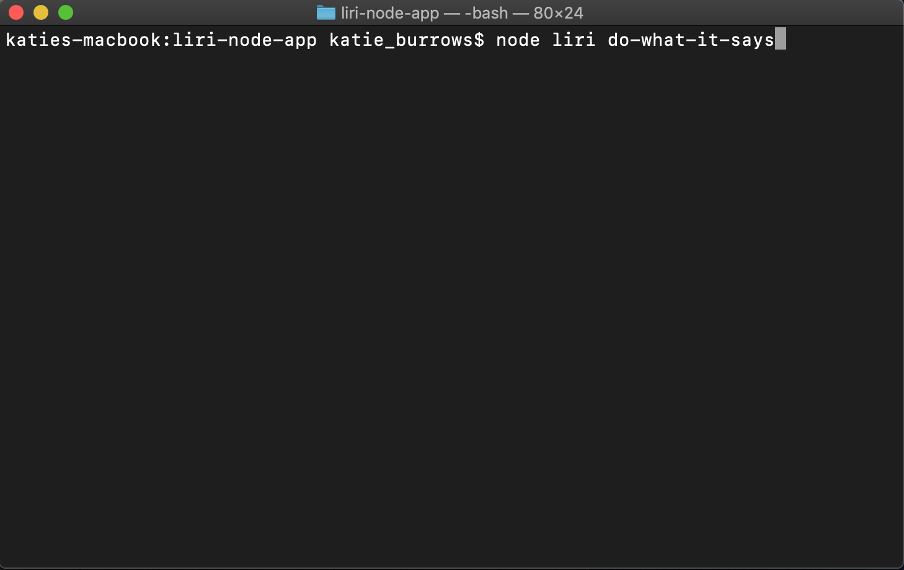

# Siri's Node-based Knockoff:  Liri

The user is able to run Liri through the CLI and give the application commands and additional, optional arguments.  There are four commands:  "my-tweets", "spotify-this-song", "movie-this", and "do-what-it-says".  Commanding my-tweets will pull back my twenty last (also sad, because I'm not a tweeter) tweets, no additional argument needed.  Commanding spotify-this-song will pull back general information and a link to play the song and album on Spotify.  Entering in a song argument is optional; if the user doesn't enter in a song the default song will be pulled up.  Commanding movie-this will pull back information on a movie.  As with the Spotify command, if no movie is entered then the default movie will come back.  Commanding do-what-it-says will read whatever I have currently entered in random.txt and follow that command, which could be tweets, song, or movie.

How to search for a movie:

The results of that search: 

How to call on Spotify:

You have the option to just command spotify (as in the picture above).  If you do it that way then the hard-coded song will be searched for.  Below the picture shows the results of searching for "That's Amore".  Either method works.

How to access my tweets:

The result of that command:

How to command the program to do what it says:

Current result of Do What it Says:

### Built With:
* JavaScript
* Node.js
* NPM packages
* Twitter's NPM
* Spotify's NPM
* Axios
* Dotenv
* OMDB's API
* fs

### Developed by Katie Burrows
